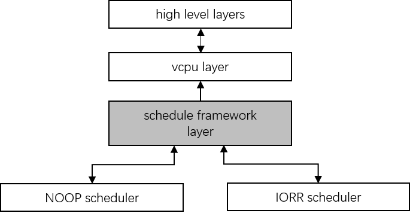
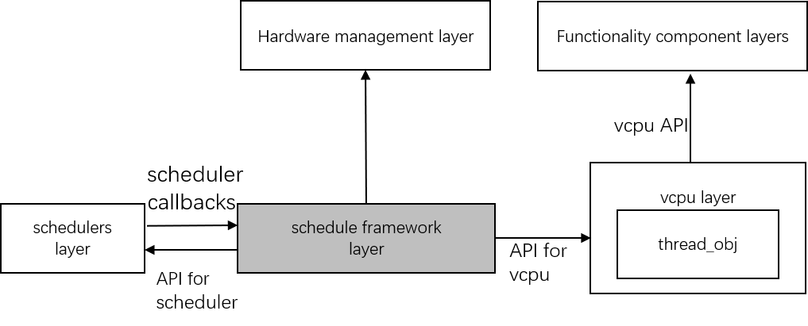
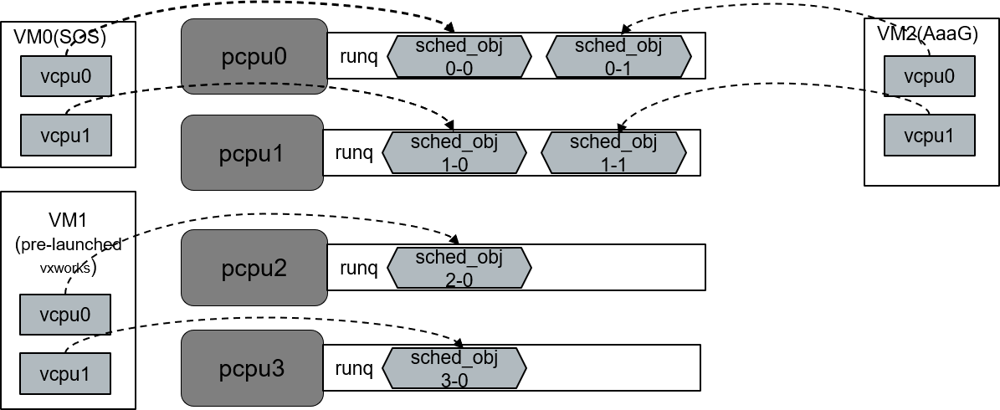

.. _cpu_sharing:

ACRN CPU Sharing
################

Introduction
************
 
The goal of CPU Sharing is to fully utilize the physical CPU resource, to support more virtual machines. Current ACRN only supports partition mode, which is a strict 1 to 1 mapping mode between vCPUs and pCPUs. Because of the lack of CPU sharing ability, the number of VM is limited. To support the CPU Sharing, we introduce a schedule framework and implement two simple tiny scheduling algorithms to satisfy embedded device requirements.

Schedule Framework
******************

To satisfy the modularization design conception,  the schedule framework layer isolates the vcpu layer and scheduler algorithm. It has not vCPU concept and can only be aware of the thread object instance. The thread object state machine will be maintained in the framework. The framework abstracts the scheduler algorithm object, so this architecture can easily extend new scheduler algorithms.

The below diagram shows that vcpu layer invokes APIs provided by schedule framework for vCPU scheduling. The schedule framework also provides some APIs for schedulers. The scheduler mainly implements some callbacks in an acrn_scheduler instance for schedule framework. Scheduling initialization is invoked in the hardware management layer.

vCPU affinity
*************

Currently, we do not support vCPU migration, the assignment of vCPU mapping to pCPU is statically configured in VM configuration via a vcpu_affinity array. The item number of the array matches the vCPU number of this VM. Each item has one bit to indicate the assigned pCPU of the corresponding vCPU. There are some rules to configure the vCPU affinity:

- Only one bit can be set for each affinity item of vCPU.
- vCPUs in the same VM cannot be assigned to the same pCPU.

Here is an example for affinity:

- VM0: 2 vCPUs, pined to pCPU0 and pCPU1
- VM1: 2 vCPUs, pined to pCPU2 and pCPU3
- VM2: 2 vCPUs, pined to pCPU2 and pCPU3

Thread object state
*******************

There are three states for thread object, RUNNING, RUNNABLE and BLOCK. States transition happens in certain conditions.

After a new vCPU is created, the corresponding thread object is initiated. The vcpu layer will invoke a wakeup operation. After wakeup, the state for the new thread object is set to RUNNABLE, then follow its algorithm to determine to preempt the current running thread object or not. If yes, it will turn to RUNNING state. In RUNNING state, the thread object may turn back to RUNNABLE state when it runs out of its timeslice, or it yields the pCPU by itself, or be preempted. The thread object under RUNNING state may trigger sleep to transfer to BLOCKED state. 

Scheduler
*********

Below block diagram shows the basic concept for the scheduler. There are two kinds of scheduler in the diagram, one is NOOP(No-Operation) scheduler and the other is IORR (IO sensitive Round-Robin) scheduler. 

- **No-Operation scheduler**:

  The NOOP(No-operation) scheduler has the same policy with original partition mode, every pCPU can run only two thread objects, one is idle thread, and another is the thread of the assigned vCPU. With this scheduler, vCPU work in work-conserving mode, and will run once it’s ready. idle thread could run when the vCPU thread blocked.

- **No-Operation scheduler**:

  IORR(IO sensitive round-robin) scheduler is implemented with per-pCPU runqueue and per-pCPU tick timer, it supports more than one vCPU running on a pCPU. The scheduler schedule thread objects in round-robin policy basically, and support preemption by timeslice counting.

  + Every thread object has an initial timeslice (ex: 10ms)
  + timeslice is consumed with time and be counted in context switch and tick handler
  + If timeslice is positive or zero, then switch out current thread object and put it to tail of runqueue.Then, pick next runnable one from runqueue to run.
  + Threads who has IO request will preempt current running thread on the same pCPU.

Scheduler configuration
***********************

There are two place in the code decide the usage for scheduler.

* The option in Kconfig decides the only scheduler used in runtime.
  ``hypervisor/arch/x86/Kconfig``

  .. literalinclude:: ../hypervisor/arch/x86/Kconfig
     :name: Kconfig for Scheduler
     :caption: Kconfig for Scheduler    
     :linenos:
     :lines: 40-58
     :emphasize-lines: 42
     :language: c

The default scheduler is **SCHED_NOOP**. To use the IORR, only need to set **SCHED_IORR** in **ACRN Scheduler**. 

* The affinity for VMs are set in  ``hypervisor/scenarios/<scenario_name>/vm_configurations.h``

   .. literalinclude:: ../hypervisor/scenarios/industry/vm_configurations.h
     :name: Affinity for VMs
     :caption: Affinity for VMs  
     :linenos:
     :lines: 31-32
     :language: c

For example, with the below changes:

      .. code-block:: none

         diff --git a/hypervisor/arch/x86/Kconfig b/hypervisor/arch/x86/Kconfig
         index 41a78fe..8ea1f9d 100644
         --- a/hypervisor/arch/x86/Kconfig
         +++ b/hypervisor/arch/x86/Kconfig
         @@ -39,7 +39,7 @@ endchoice
         
          choice
                 prompt "ACRN Scheduler"
         -       default SCHED_NOOP
         +       default SCHED_IORR
                 help
                   Select the CPU scheduler to be used by the hypervisor
         
         diff --git a/hypervisor/scenarios/industry/vm_configurations.h b/hypervisor/scenarios/industry/vm_configurations.h
         index 482801a..d76510d 100644
         --- a/hypervisor/scenarios/industry/vm_configurations.h
         +++ b/hypervisor/scenarios/industry/vm_configurations.h
         @@ -28,7 +28,7 @@
                                                 "i915.enable_gvt=1 "    \
                                                 SOS_BOOTARGS_DIFF
         
         -#define        VM1_CONFIG_VCPU_AFFINITY        {AFFINITY_CPU(1U)}
         +#define        VM1_CONFIG_VCPU_AFFINITY        {AFFINITY_CPU(0U)}
          #define        VM2_CONFIG_VCPU_AFFINITY        {AFFINITY_CPU(2U), AFFINITY_CPU(3U)}
   

From ACRN Hypervisor console:

      .. code-block:: none

        ACRN:\>vcpu_list
        
        VM ID    PCPU ID    VCPU ID    VCPU ROLE    VCPU STATE
        =====    =======    =======    =========    ==========
          0         0          0       PRIMARY      Running
          1         0          0       PRIMARY      Running
          2         2          0       PRIMARY      Running
          2         3          1       SECONDARY    Running

VM1 has one vCPU, and run on pCPU 0.
VM2 has two vCPU, and run on pCPU 2 and pCPU3. 
